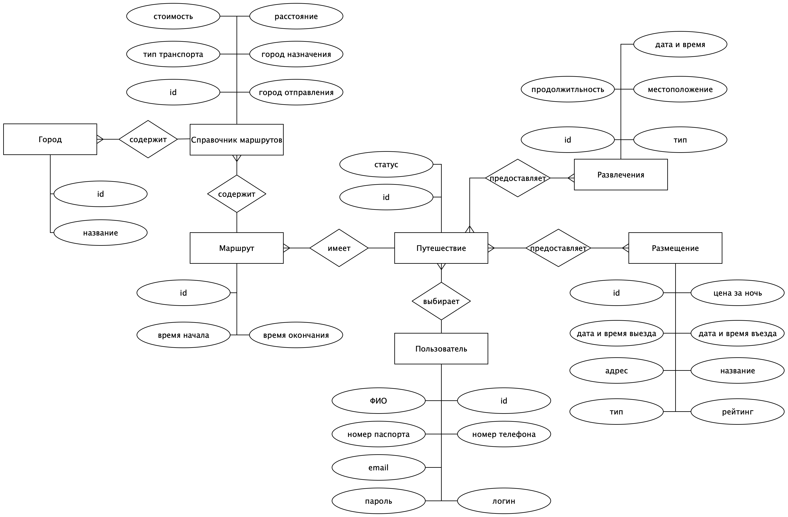
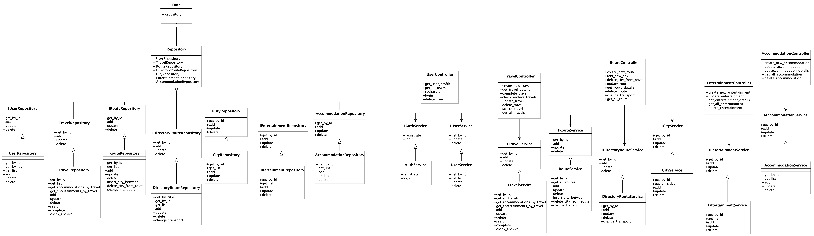

## Название проекта

Помощник путешественника.

## Описание идеи проекта

Приложение для планирования путешествий, которое помогает пользователям находить оптимальные варианты билетов, проживания и развлечений в выбранном городе. Приложение также рассчитывает общую стоимость путешествия, упрощая процесс планирования. Это позволит пользователям быстро и удобно организовать свои поездки.

## Описание предметной области

Сущности:
1. Пользователь
2. Путешествие
3. Маршрут
4. Город
5. Справочник маршрутов
6. Развлечения
7. Размещение

Роли:
1. Пользователь
2. Администратор

## Анализ аналогичных решений по минимум 3 критериям

|Название|Транспорт|Гостиница|Достопримечательности| 
|--------|----------|-------------|--------------|
|KAYAK|+|+|-| 
|Rome2Rio|+|-|+|
|Мой проект|+|+|+|  

##5 Обоснование целесообразности и актуальности проекта 

Актуальность проекта заключается в упрощение планирования путешествий, позволяя пользователям легко находить и бронировать транспорт, гостиницы и развлечения в одном месте. С учетом растущего интереса к путешествиям, создание удобного и функционального приложения становится необходимо. Это поможет пользователям сэкономить время и сделать процесс организации поездок более комфортным.

##6 Описание акторов (ролей)

1. Пользователь: основной пользователь приложения, который планирует свои путешествия.
2. Администратор -- обеспечивает актуальность и качество контента. Он отвечает за наполнение платформы информацией о гостиницах, развлечениях и маршрутах.

## Use-Case - диаграмма 

## ER-диаграмма сущностей 

## Пользовательские сценарии

1. Зайти на основую страницу.
2. Авторизоваться, зайти на страницу своего профиля.
3. Зайти на страницу регистрации, зарегестрироваться или перейти на страницу авторизации.
4. Зайти на страницу авторизации, авторизироваться или перейти на страницу регистрации.
5. Посмотреть архив путешествия.
6. Просмотреть авторские туры.
7. Оплатить бронь.
8. Посмотреть ближайшие запланированные мероприятия в текущем путешествии.
9. Поиск и фильтрация путешествий.

## Формализация ключевых бизнес-процессов

## Технологический стек

* *Тип приложения* - Web MPA  
* *backend* - Python / C#
* *frontend* - Python / C#
* *database* - PostgreSQL  

## Верхнеуровневое разбиение на компоненты

## UML диаграммы классов для компонентов доступа к данным бизнес-логики

